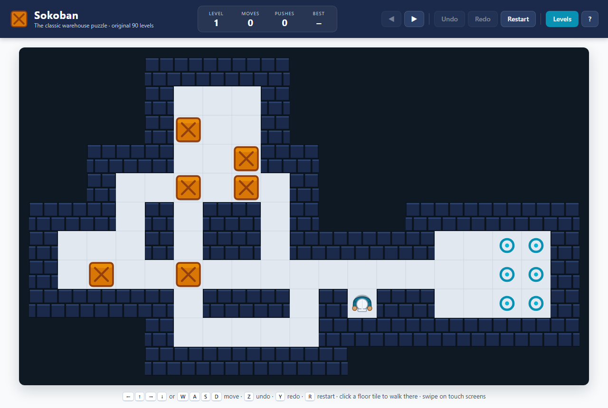
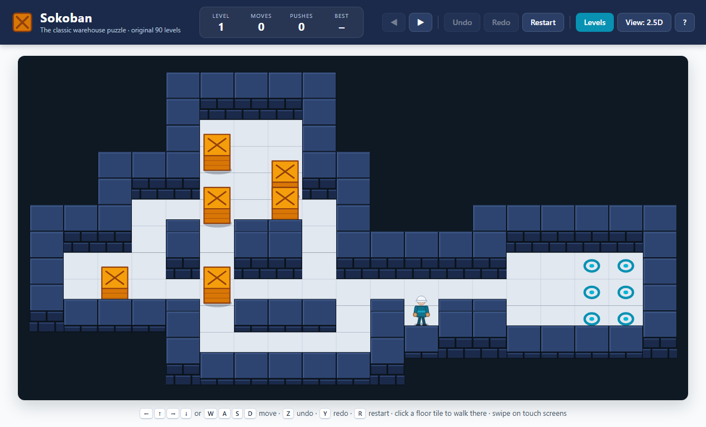

# Sokoban

A faithful remake of the classic 1982 warehouse-keeper puzzle, with the original 90 levels.
Plain HTML5 Canvas + vanilla JavaScript - no framework, no build step, no dependencies.

Play it in classic top-down 2D or in a 2.5D view - same levels, same progress, same controls.

| Classic 2D | 2.5D |
| --- | --- |
|  |  |

## Play

**Online: https://robertorenz.github.io/sokobanRemake/**

Or open `index.html` in any modern browser, or serve the folder with any static file server:

```sh
npx serve .            # or: python -m http.server
```

Your progress (solved levels and best move/push counts) is saved in the browser's `localStorage`.

## Controls

| Action | Keys |
| --- | --- |
| Move | Arrow keys or `W` `A` `S` `D` |
| Walk to a tile | Click / tap any reachable floor tile |
| Push a crate | Click a crate next to you, or move into it |
| Undo / Redo | `Z` / `Y` (also `U`, `Backspace`, `Ctrl+Z`, `Ctrl+Y`) |
| Restart level | `R` |
| Next / previous level | `N` / `P` (or `]` / `[`) |
| Level picker | `L` |
| Switch 2D / 2.5D view | `V` |
| Help | `?` |
| Touch | Swipe in the direction you want to move |

### 2D or 2.5D?

The game asks which view you want when it starts (tick "don't ask again" to skip that in future;
the help dialog can bring the question back). The 2.5D view keeps the grid straight - up is up,
right is right - and just tilts the camera forward so walls, crates and the keeper have height.
Click-to-walk and swipes work in both views.

## Rules

Push every crate onto a goal marker. You can only push - never pull - and only one crate at a time.
Crates turn green when they sit on a goal. The level is solved when every crate is on a goal.

## The levels

| # | Set | Origin |
| --- | --- | --- |
| 1-50 | Original | Thinking Rabbit (Hiroyuki Imabayashi), Sokoban 1982-84 |
| 51-90 | Extra | The classic "Extra" set that has shipped with xsokoban since 1989 |

`js/levels.js` is generated by `tools/fetch-levels.mjs`, which downloads the screens from the
public-domain [xsokoban](https://github.com/andrewcmyers/xsokoban) distribution:

```sh
node tools/fetch-levels.mjs
```

The layouts themselves remain the property of Thinking Rabbit and are included here for
non-commercial use, as they have been in free Sokoban programs for decades. See `LICENSE`.

### Adding your own level sets

Levels use the standard text format (`#` wall, `@` player, `$` crate, `.` goal, `*` crate on goal,
`+` player on goal, space = floor). Add another entry to `window.SOKOBAN_LEVEL_SETS` in
`js/levels.js`:

```js
{
  id: 'my-levels',
  name: 'My Levels',
  author: 'You',
  description: 'Optional blurb shown in the level picker.',
  groups: [{ name: 'Easy', count: 5 }, { name: 'Hard', count: 5 }],   // optional
  levels: [
    "#####\n#@$.#\n#####",
    // ...
  ]
}
```

The level picker shows a set selector automatically when more than one set is present.

## Project layout

```
index.html            page shell and modal dialogs
css/style.css         styling (navy / teal palette)
js/game.js            engine, input, UI and the per-frame scene
js/view2d.js          classic top-down renderer
js/view25d.js         2.5D tilted top-down renderer
js/levels.js          generated level data (90 levels)
tools/fetch-levels.mjs  regenerates js/levels.js from xsokoban
docs/screenshot.png, docs/screenshot-25d.png
```

### How it works

- **Parsing** - each level string becomes a wall grid, a goal grid, a crate grid and a player
  position. A flood fill from the player marks the reachable interior so the outside is drawn as
  background instead of floor.
- **Moves** - a move is `{dx, dy, pushed}`. Undo reverses it exactly, so undo/redo are O(1) and
  unlimited.
- **Auto-walk** - clicking a floor tile runs a breadth-first search over crate-free floor and
  replays the path step by step (never pushing anything).
- **Rendering** - every tile (bricks, crates, goals, the keeper) is drawn procedurally on a
  `<canvas>`; the tile size adapts to the window and the backing store scales with
  `devicePixelRatio`, so it stays crisp on high-DPI screens.
- **Views** - `game.js` builds an interpolated scene each frame (level, crates, the keeper's
  fractional position, facing and pose) and hands it to the active view. A view is a small object
  with `layout(cols, rows, availW, availH)`, `render(scene)` and `cellAt(px, py)`, so adding
  another look is a matter of writing one more file.
- **The keeper** - a warehouse worker (hard hat, shoulders, gloves, boots). Each step runs a short
  animation: walking alternates the feet and swings the arms. A push has two phases: first the
  keeper braces against the crate - leaning in, back foot digging in, trembling, sweat flying,
  the crate shivering in place - then it gives way and both slide to the next cell. A key pressed
  during a shove is buffered until it finishes, so a held key gives a steady push rhythm. Undo is
  a plain slide back.
  The 2D view draws them from directly above and rotates to the facing direction; the 2.5D view
  draws them standing up - back view walking up, face on walking down, profile left and right.
- **2.5D view** - a "3/4" projection: cells are slightly foreshortened (depth 0.78 x width), walls
  and crates are extruded upward with a visible brick / plank front face, and rows are drawn top
  to bottom so nearer things overlap farther ones. Walls that would hide the floor cell behind
  them are drawn as low curbs ("cutaway"), so the whole board stays visible while the back and
  side walls keep their full height.

## License

Code: MIT. Level data: see the notice in `LICENSE`.
